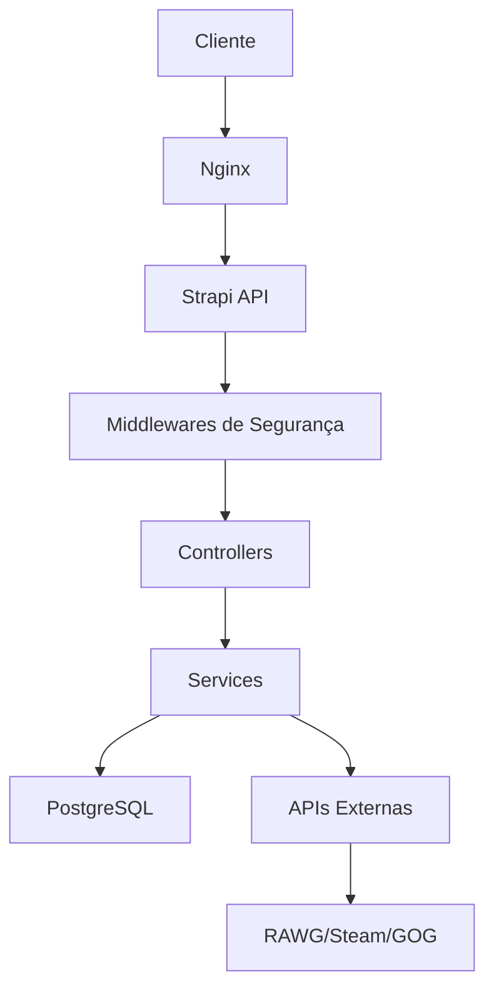

# 📁 Estrutura do Projeto RootGames API

Este documento descreve a estrutura completa do projeto RootGames API, explicando cada pasta, arquivo e sua funcionalidade.

## 🏗️ Arquitetura Geral

O RootGames API é uma aplicação **Strapi 4.12.5** com **TypeScript**, **PostgreSQL** e funcionalidades avançadas de segurança, monitoramento e CI/CD.

```
rootgames-api/
├── 📁 config/           # Configurações do Strapi
├── 📁 src/              # Código fonte da aplicação
├── 📁 tests/            # Testes automatizados
├── 📁 scripts/          # Scripts de automação
├── 📁 docs/             # Documentação
├── 📁 .github/          # GitHub Actions (CI/CD)
├── 📁 logs/             # Logs e relatórios
├── 📁 public/           # Arquivos estáticos
└── 📁 security/         # Configurações de segurança
```

---

## 📁 Estrutura Detalhada

### 🔧 **config/** - Configurações do Strapi

| Arquivo | Descrição | Funcionalidade |
|---------|-----------|----------------|
| `admin.ts` | Configuração do painel admin | Personalização do admin panel, cores, logos |
| `api.ts` | Configuração da API | Rate limiting, paginação, filtros globais |
| `database.ts` | Configuração do banco | Conexão PostgreSQL, migrações, SSL |
| `middlewares.ts` | Middlewares globais | Segurança, CORS, autenticação |
| `middlewares.js` | Middlewares JS (legacy) | Compatibilidade com versões antigas |
| `security.js` | Configurações de segurança | Headers, CSP, validações |
| `server.ts` | Configuração do servidor | Porta, host, SSL, timeouts |
| `api-keys.js` | Chaves de API | Validação e gerenciamento de chaves |

### 🎮 **src/api/** - APIs e Content Types

#### **game/** - Gerenciamento de Jogos
- **`content-types/game/schema.json`**: Schema do content type Game
- **`controllers/game.ts`**: Lógica de negócio para jogos
- **`routes/game.ts`**: Rotas básicas CRUD
- **`routes/images.ts`**: Rotas para gerenciamento de imagens
- **`routes/populate.ts`**: Rotas para popular dados
- **`services/game.ts`**: Serviços de jogos
- **`services/image-search.service.js`**: Busca de imagens em APIs externas

#### **category/** - Categorias de Jogos
- **`content-types/category/schema.json`**: Schema de categorias
- **`controllers/category.ts`**: CRUD de categorias
- **`routes/category.ts`**: Rotas de categorias
- **`services/category.ts`**: Serviços de categorias

#### **developer/** - Desenvolvedores
- **`content-types/developer/schema.json`**: Schema de desenvolvedores
- **`controllers/developer.ts`**: CRUD de desenvolvedores
- **`routes/developer.ts`**: Rotas de desenvolvedores
- **`services/developer.ts`**: Serviços de desenvolvedores

#### **platform/** - Plataformas
- **`content-types/platform/schema.json`**: Schema de plataformas
- **`controllers/platform.ts`**: CRUD de plataformas
- **`routes/platform.ts`**: Rotas de plataformas
- **`services/platform.ts`**: Serviços de plataformas

#### **publisher/** - Publicadores
- **`content-types/publisher/schema.json`**: Schema de publicadores
- **`controllers/publisher.ts`**: CRUD de publicadores
- **`routes/publisher.ts`**: Rotas de publicadores
- **`services/publisher.ts`**: Serviços de publicadores

#### **admin/** - API Administrativa
- **`controllers/admin.ts`**: Controllers administrativos
- **`routes/admin.ts`**: Rotas protegidas por API key
- **`services/admin.ts`**: Serviços administrativos

#### **seo/** - Otimização SEO
- **`content-types/seo/schema.json`**: Schema SEO
- **`controllers/seo.js`**: Controllers de SEO
- **`routes/seo.js`**: Rotas de SEO
- **`services/seo.js`**: Serviços de SEO

#### **swagger/** - Documentação da API
- **`controllers/swagger.ts`**: Controller da documentação
- **`routes/swagger.ts`**: Rotas da documentação
- **`swagger.config.js`**: Configuração do Swagger/OpenAPI

### 🛡️ **src/middlewares/** - Middlewares de Segurança

| Arquivo | Descrição | Funcionalidade |
|---------|-----------|----------------|
| `api-key-auth.ts` | Autenticação por API key | Proteção de rotas administrativas |
| `rate-limiting.ts` | Rate limiting | Controle de requisições por IP |
| `security-headers.ts` | Headers de segurança | CSP, HSTS, XSS Protection |
| `security-logging.ts` | Logging de segurança | Registro de eventos suspeitos |
| `upload-validation.ts` | Validação de upload | Verificação de arquivos |
| `security.js` | Middleware principal | Orquestração de segurança |
| `seo-middleware.js` | Middleware SEO | Otimização automática |

### 🧪 **tests/** - Testes Automatizados

#### **unit/** - Testes Unitários
- **`game.test.ts`**: Testes unitários do serviço de jogos

#### **integration/** - Testes de Integração
- **`api.test.ts`**: Testes de integração das APIs

#### **e2e/** - Testes End-to-End
- **`security.test.ts`**: Testes E2E de segurança

#### **performance/** - Testes de Performance
- **`load.test.ts`**: Testes de carga e performance

#### **setup.ts** - Configuração dos Testes
- Configuração global do Jest
- Mocks e variáveis de ambiente

### 🔧 **scripts/** - Scripts de Automação

#### **Gerenciamento de Imagens**
- **`associate-images-with-games.js`**: Associar imagens aos jogos
- **`check-games-images.js`**: Verificar status das imagens
- **`create-complete-game-images.js`**: Criar imagens completas
- **`create-game-covers.js`**: Criar capas de jogos
- **`download-game-images.js`**: Baixar imagens de APIs externas
- **`fetch-real-game-images.js`**: Buscar imagens reais
- **`fix-heroes-gallery.js`**: Corrigir galeria específica
- **`image-organizer.js`**: Organizar imagens
- **`manage-images.js`**: Gerenciar imagens em massa
- **`monitor-quality.js`**: Monitorar qualidade das imagens
- **`smart-downloader.js`**: Download inteligente

#### **Segurança e Monitoramento**
- **`backup-security.sh`**: Backup de configurações de segurança
- **`security-monitor.js`**: Monitoramento contínuo de segurança
- **`setup-security.js`**: Configuração inicial de segurança
- **`start-security-monitor.sh`**: Iniciar monitor de segurança
- **`test-security.js`**: Testes de segurança
- **`vulnerability-scanner.js`**: Scanner de vulnerabilidades

#### **Deploy e Infraestrutura**
- **`deploy.sh`**: Script de deploy automatizado
- **`webhook-server.js`**: Servidor de webhooks para deploy
- **`monitoring-setup.js`**: Configuração de monitoramento

#### **SEO e Otimização**
- **`seo-setup.js`**: Configuração inicial de SEO
- **`test-seo-complete.js`**: Testes completos de SEO

#### **Configuração e Setup**
- **`configure-apis.js`**: Configurar APIs externas
- **`setup-apis.js`**: Setup de APIs

### 📊 **.github/workflows/** - CI/CD

| Arquivo | Descrição | Funcionalidade |
|---------|-----------|----------------|
| `ci-cd.yml` | Pipeline principal | Build, testes, deploy |
| `security.yml` | Pipeline de segurança | Scanner de vulnerabilidades |

### 📚 **docs/** - Documentação

| Arquivo | Descrição | Conteúdo |
|---------|-----------|----------|
| `PROJECT_STRUCTURE.md` | Estrutura do projeto | Este arquivo |
| `DEPLOYMENT.md` | Guia de deploy | Instruções de produção |
| `API_IMAGENS_AVANCADO.md` | API de imagens | Documentação de imagens |
| `SEO-IMPLEMENTATION.md` | Implementação SEO | Guia de SEO |

### 📁 **Outras Pastas**

#### **logs/** - Logs e Relatórios
- **`backups/`**: Backups de logs
- **`reports/`**: Relatórios de vulnerabilidades
- **`security-*.json`**: Logs de segurança

#### **public/** - Arquivos Estáticos
- **`uploads/`**: Imagens e arquivos enviados
- **`robots.txt`**: Configuração de SEO

#### **database/** - Banco de Dados
- **`migrations/`**: Migrações do banco

#### **security/** - Configurações de Segurança
- Configurações específicas de segurança

---

## 🔄 Fluxo de Dados



## 🛡️ Camadas de Segurança

1. **Nginx** - Proxy reverso e SSL
2. **Rate Limiting** - Controle de requisições
3. **API Key Auth** - Autenticação de rotas
4. **Security Headers** - Headers de proteção
5. **Upload Validation** - Validação de arquivos
6. **Security Logging** - Monitoramento de eventos

## 📈 Monitoramento

- **Prometheus** - Métricas
- **Grafana** - Dashboards
- **Alertmanager** - Alertas
- **Security Logs** - Logs de segurança
- **Health Checks** - Verificações de saúde

---

**Última atualização**: Setembro 2025  
**Versão**: 1.0.0  
**Mantido por**: Equipe RootGames
