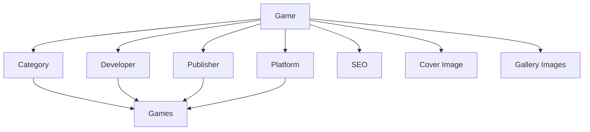

# 🎮 SRC API Documentation - RootGames API

Documentação detalhada da pasta `src/api/` contendo todos os content types, controllers, routes e services.

## 📋 Índice

- [Visão Geral](#-visão-geral)
- [Game API](#-game-api)
- [Category API](#-category-api)
- [Developer API](#-developer-api)
- [Platform API](#-platform-api)
- [Publisher API](#-publisher-api)
- [Admin API](#-admin-api)
- [SEO API](#-seo-api)
- [Swagger API](#-swagger-api)

---

## 🎯 Visão Geral

A pasta `src/api/` contém toda a lógica de API do Strapi, organizada por content types. Cada content type possui:

- **Content Types** - Schema dos dados
- **Controllers** - Lógica de negócio
- **Routes** - Definição de rotas
- **Services** - Serviços de dados

### Estrutura da API

```
src/api/
├── game/              # Gerenciamento de jogos
├── category/          # Categorias de jogos
├── developer/         # Desenvolvedores
├── platform/         # Plataformas
├── publisher/         # Publicadores
├── admin/            # API administrativa
├── seo/              # Otimização SEO
└── swagger/          # Documentação da API
```

---

## 🎮 Game API

### Localização: `src/api/game/`

**Funcionalidade:** Gerenciamento completo de jogos, incluindo imagens, metadados e relacionamentos.

### Content Type (`content-types/game/schema.json`)

```json
{
  "kind": "collectionType",
  "collectionName": "games",
  "info": {
    "singularName": "game",
    "pluralName": "games",
    "displayName": "Game",
    "description": "Jogos do catálogo RootGames"
  },
  "options": {
    "draftAndPublish": true
  },
  "pluginOptions": {},
  "attributes": {
    "name": {
      "type": "string",
      "required": true,
      "unique": true
    },
    "slug": {
      "type": "uid",
      "targetField": "name",
      "required": true
    },
    "description": {
      "type": "text",
      "required": true
    },
    "releaseDate": {
      "type": "date"
    },
    "rating": {
      "type": "decimal",
      "min": 0,
      "max": 10
    },
    "category": {
      "type": "relation",
      "relation": "manyToOne",
      "target": "api::category.category"
    },
    "developer": {
      "type": "relation",
      "relation": "manyToOne",
      "target": "api::developer.developer"
    },
    "publisher": {
      "type": "relation",
      "relation": "manyToOne",
      "target": "api::publisher.publisher"
    },
    "platforms": {
      "type": "relation",
      "relation": "manyToMany",
      "target": "api::platform.platform"
    },
    "cover": {
      "type": "media",
      "multiple": false,
      "required": false,
      "allowedTypes": ["images"]
    },
    "gallery": {
      "type": "media",
      "multiple": true,
      "required": false,
      "allowedTypes": ["images"]
    },
    "seo": {
      "type": "relation",
      "relation": "oneToOne",
      "target": "api::seo.seo"
    }
  }
}
```

### Controller (`controllers/game.ts`)

**Funcionalidade:** Lógica de negócio para operações de jogos.

```typescript
import { factories } from "@strapi/strapi";

export default factories.createCoreController("api::game.game", ({ strapi }) => ({
  // Métodos padrão do Strapi (find, findOne, create, update, delete)
  // + métodos customizados

  async find(ctx) {
    // Lógica customizada para listar jogos
    const { data, meta } = await super.find(ctx);
    
    // Adicionar lógica customizada aqui
    return { data, meta };
  },

  async findOne(ctx) {
    // Lógica customizada para buscar um jogo
    const { data } = await super.findOne(ctx);
    
    // Adicionar lógica customizada aqui
    return { data };
  },

  async create(ctx) {
    // Lógica customizada para criar jogo
    const { data } = await super.create(ctx);
    
    // Adicionar lógica customizada aqui
    return { data };
  },

  async update(ctx) {
    // Lógica customizada para atualizar jogo
    const { data } = await super.update(ctx);
    
    // Adicionar lógica customizada aqui
    return { data };
  },

  async delete(ctx) {
    // Lógica customizada para deletar jogo
    const { data } = await super.delete(ctx);
    
    // Adicionar lógica customizada aqui
    return { data };
  },
}));
```

### Routes

#### Rotas Básicas (`routes/game.ts`)

```typescript
export default {
  routes: [
    {
      method: "GET",
      path: "/games",
      handler: "game.find",
      config: {
        policies: [],
        middlewares: [],
      },
    },
    {
      method: "GET",
      path: "/games/:id",
      handler: "game.findOne",
      config: {
        policies: [],
        middlewares: [],
      },
    },
    {
      method: "POST",
      path: "/games",
      handler: "game.create",
      config: {
        policies: [],
        middlewares: [],
      },
    },
    {
      method: "PUT",
      path: "/games/:id",
      handler: "game.update",
      config: {
        policies: [],
        middlewares: [],
      },
    },
    {
      method: "DELETE",
      path: "/games/:id",
      handler: "game.delete",
      config: {
        policies: [],
        middlewares: [],
      },
    },
  ],
};
```

#### Rotas de Imagens (`routes/images.ts`)

```typescript
export default {
  routes: [
    {
      method: "GET",
      path: "/games/images/search",
      handler: "game.searchImages",
      config: {
        policies: [],
        middlewares: [],
      },
    },
    {
      method: "POST",
      path: "/games/:id/images/download",
      handler: "game.downloadImages",
      config: {
        policies: [],
        middlewares: ["global::api-key-auth"],
      },
    },
    {
      method: "GET",
      path: "/games/images/sources",
      handler: "game.getImageSources",
      config: {
        policies: [],
        middlewares: [],
      },
    },
  ],
};
```

#### Rotas de Populate (`routes/populate.ts`)

```typescript
export default {
  routes: [
    {
      method: "GET",
      path: "/games/populate",
      handler: "game.populateGames",
      config: {
        policies: [],
        middlewares: ["global::api-key-auth"],
      },
    },
    {
      method: "POST",
      path: "/games/populate/batch",
      handler: "game.populateBatch",
      config: {
        policies: [],
        middlewares: ["global::api-key-auth"],
      },
    },
  ],
};
```

### Service (`services/game.ts`)

**Funcionalidade:** Serviços de dados para jogos.

```typescript
import { factories } from "@strapi/strapi";

export default factories.createCoreService("api::game.game", ({ strapi }) => ({
  // Métodos padrão do Strapi
  // + métodos customizados

  async findMany(params) {
    return strapi.entityService.findMany("api::game.game", params);
  },

  async findOne(id, params) {
    return strapi.entityService.findOne("api::game.game", id, params);
  },

  async create(data) {
    return strapi.entityService.create("api::game.game", { data });
  },

  async update(id, data) {
    return strapi.entityService.update("api::game.game", id, { data });
  },

  async delete(id) {
    return strapi.entityService.delete("api::game.game", id);
  },

  // Métodos customizados
  async searchImages(query, source, type, limit) {
    // Lógica para buscar imagens em APIs externas
  },

  async downloadImages(gameId, images, source) {
    // Lógica para baixar e associar imagens
  },

  async getImageSources() {
    // Lógica para listar fontes de imagens
  },

  async populateGames() {
    // Lógica para popular jogos com dados externos
  },
}));
```

### Image Search Service (`services/image-search.service.js`)

**Funcionalidade:** Serviço especializado para busca de imagens.

```javascript
class ImageSearchService {
  constructor(strapi) {
    this.strapi = strapi;
    this.sources = {
      rawg: {
        name: "RAWG.io",
        baseUrl: "https://api.rawg.io/api",
        apiKey: process.env.RAWG_API_KEY,
        enabled: true,
      },
      steam: {
        name: "Steam",
        baseUrl: "https://store.steampowered.com/api",
        enabled: true,
      },
      gog: {
        name: "GOG",
        baseUrl: "https://www.gog.com/api",
        enabled: true,
      },
      igdb: {
        name: "IGDB",
        baseUrl: "https://api.igdb.com/v4",
        apiKey: process.env.IGDB_API_KEY,
        enabled: true,
      },
    };
  }

  async searchImages(query, source, type, limit) {
    // Lógica para buscar imagens
  }

  async downloadImage(url, gameId, type) {
    // Lógica para baixar imagem
  }

  async associateImage(gameId, imageData) {
    // Lógica para associar imagem ao jogo
  }
}

module.exports = ImageSearchService;
```

---

## 📂 Category API

### Localização: `src/api/category/`

**Funcionalidade:** Gerenciamento de categorias de jogos.

### Content Type (`content-types/category/schema.json`)

```json
{
  "kind": "collectionType",
  "collectionName": "categories",
  "info": {
    "singularName": "category",
    "pluralName": "categories",
    "displayName": "Category",
    "description": "Categorias de jogos"
  },
  "options": {
    "draftAndPublish": true
  },
  "attributes": {
    "name": {
      "type": "string",
      "required": true,
      "unique": true
    },
    "slug": {
      "type": "uid",
      "targetField": "name",
      "required": true
    },
    "description": {
      "type": "text"
    },
    "color": {
      "type": "string",
      "default": "#2e8b57"
    },
    "icon": {
      "type": "string"
    },
    "games": {
      "type": "relation",
      "relation": "oneToMany",
      "target": "api::game.game",
      "mappedBy": "category"
    }
  }
}
```

### Controller (`controllers/category.ts`)

```typescript
import { factories } from "@strapi/strapi";

export default factories.createCoreController("api::category.category", ({ strapi }) => ({
  // Métodos padrão do Strapi
  async find(ctx) {
    const { data, meta } = await super.find(ctx);
    return { data, meta };
  },

  async findOne(ctx) {
    const { data } = await super.findOne(ctx);
    return { data };
  },

  async create(ctx) {
    const { data } = await super.create(ctx);
    return { data };
  },

  async update(ctx) {
    const { data } = await super.update(ctx);
    return { data };
  },

  async delete(ctx) {
    const { data } = await super.delete(ctx);
    return { data };
  },
}));
```

### Routes (`routes/category.ts`)

```typescript
export default {
  routes: [
    {
      method: "GET",
      path: "/categories",
      handler: "category.find",
      config: {
        policies: [],
        middlewares: [],
      },
    },
    {
      method: "GET",
      path: "/categories/:id",
      handler: "category.findOne",
      config: {
        policies: [],
        middlewares: [],
      },
    },
    {
      method: "POST",
      path: "/categories",
      handler: "category.create",
      config: {
        policies: [],
        middlewares: ["global::api-key-auth"],
      },
    },
    {
      method: "PUT",
      path: "/categories/:id",
      handler: "category.update",
      config: {
        policies: [],
        middlewares: ["global::api-key-auth"],
      },
    },
    {
      method: "DELETE",
      path: "/categories/:id",
      handler: "category.delete",
      config: {
        policies: [],
        middlewares: ["global::api-key-auth"],
      },
    },
  ],
};
```

### Service (`services/category.ts`)

```typescript
import { factories } from "@strapi/strapi";

export default factories.createCoreService("api::category.category", ({ strapi }) => ({
  async findMany(params) {
    return strapi.entityService.findMany("api::category.category", params);
  },

  async findOne(id, params) {
    return strapi.entityService.findOne("api::category.category", id, params);
  },

  async create(data) {
    return strapi.entityService.create("api::category.category", { data });
  },

  async update(id, data) {
    return strapi.entityService.update("api::category.category", id, { data });
  },

  async delete(id) {
    return strapi.entityService.delete("api::category.category", id);
  },
}));
```

---

## 👨‍💻 Developer API

### Localização: `src/api/developer/`

**Funcionalidade:** Gerenciamento de desenvolvedores de jogos.

### Content Type (`content-types/developer/schema.json`)

```json
{
  "kind": "collectionType",
  "collectionName": "developers",
  "info": {
    "singularName": "developer",
    "pluralName": "developers",
    "displayName": "Developer",
    "description": "Desenvolvedores de jogos"
  },
  "options": {
    "draftAndPublish": true
  },
  "attributes": {
    "name": {
      "type": "string",
      "required": true,
      "unique": true
    },
    "slug": {
      "type": "uid",
      "targetField": "name",
      "required": true
    },
    "description": {
      "type": "text"
    },
    "founded": {
      "type": "date"
    },
    "country": {
      "type": "string"
    },
    "website": {
      "type": "string"
    },
    "logo": {
      "type": "media",
      "multiple": false,
      "allowedTypes": ["images"]
    },
    "games": {
      "type": "relation",
      "relation": "oneToMany",
      "target": "api::game.game",
      "mappedBy": "developer"
    }
  }
}
```

---

## 🎮 Platform API

### Localização: `src/api/platform/`

**Funcionalidade:** Gerenciamento de plataformas de jogos.

### Content Type (`content-types/platform/schema.json`)

```json
{
  "kind": "collectionType",
  "collectionName": "platforms",
  "info": {
    "singularName": "platform",
    "pluralName": "platforms",
    "displayName": "Platform",
    "description": "Plataformas de jogos"
  },
  "options": {
    "draftAndPublish": true
  },
  "attributes": {
    "name": {
      "type": "string",
      "required": true,
      "unique": true
    },
    "slug": {
      "type": "uid",
      "targetField": "name",
      "required": true
    },
    "description": {
      "type": "text"
    },
    "type": {
      "type": "enumeration",
      "enum": ["console", "pc", "mobile", "handheld", "arcade"],
      "required": true
    },
    "releaseDate": {
      "type": "date"
    },
    "manufacturer": {
      "type": "string"
    },
    "icon": {
      "type": "media",
      "multiple": false,
      "allowedTypes": ["images"]
    },
    "games": {
      "type": "relation",
      "relation": "manyToMany",
      "target": "api::game.game",
      "inversedBy": "platforms"
    }
  }
}
```

---

## 🏢 Publisher API

### Localização: `src/api/publisher/`

**Funcionalidade:** Gerenciamento de publicadores de jogos.

### Content Type (`content-types/publisher/schema.json`)

```json
{
  "kind": "collectionType",
  "collectionName": "publishers",
  "info": {
    "singularName": "publisher",
    "pluralName": "publishers",
    "displayName": "Publisher",
    "description": "Publicadores de jogos"
  },
  "options": {
    "draftAndPublish": true
  },
  "attributes": {
    "name": {
      "type": "string",
      "required": true,
      "unique": true
    },
    "slug": {
      "type": "uid",
      "targetField": "name",
      "required": true
    },
    "description": {
      "type": "text"
    },
    "founded": {
      "type": "date"
    },
    "country": {
      "type": "string"
    },
    "website": {
      "type": "string"
    },
    "logo": {
      "type": "media",
      "multiple": false,
      "allowedTypes": ["images"]
    },
    "games": {
      "type": "relation",
      "relation": "oneToMany",
      "target": "api::game.game",
      "mappedBy": "publisher"
    }
  }
}
```

---

## 🔐 Admin API

### Localização: `src/api/admin/`

**Funcionalidade:** API administrativa com rotas protegidas por API key.

### Controller (`controllers/admin.ts`)

```typescript
import { factories } from "@strapi/strapi";
const axios = require("axios");

export default factories.createCoreController("api::admin.admin", ({ strapi }) => ({
  async testExternalAPIs(ctx) {
    try {
      const results: any = {};

      // Testar RAWG API
      try {
        const rawgResponse = await axios.get("https://api.rawg.io/api/games?key=test", {
          timeout: 5000,
        });
        results.rawg = {
          status: "success",
          statusCode: rawgResponse.status,
        };
      } catch (error: any) {
        results.rawg = {
          status: "error",
          message: error.message,
        };
      }

      // Testar Steam API
      try {
        const steamResponse = await axios.get("https://store.steampowered.com/api/appdetails?appids=730", {
          timeout: 5000,
        });
        results.steam = {
          status: "success",
          statusCode: steamResponse.status,
        };
      } catch (error: any) {
        results.steam = {
          status: "error",
          message: error.message,
        };
      }

      ctx.body = {
        success: true,
        data: results,
      };
    } catch (error: any) {
      ctx.throw(500, error.message);
    }
  },

  async getSystemInfo(ctx) {
    try {
      const systemInfo = {
        version: strapi.config.get("info.version"),
        uptime: process.uptime(),
        memory: process.memoryUsage(),
        cpu: process.cpuUsage(),
        database: "connected", // Verificar status real
      };

      ctx.body = {
        success: true,
        system: systemInfo,
      };
    } catch (error: any) {
      ctx.throw(500, error.message);
    }
  },

  async getSecurityStats(ctx) {
    try {
      const securityStats = {
        totalRequests: 0, // Implementar contador real
        blockedRequests: 0,
        suspiciousActivity: 0,
        lastScan: new Date().toISOString(),
        vulnerabilities: 0,
      };

      ctx.body = {
        success: true,
        stats: securityStats,
      };
    } catch (error: any) {
      ctx.throw(500, error.message);
    }
  },
}));
```

### Routes (`routes/admin.ts`)

```typescript
export default {
  routes: [
    {
      method: "GET",
      path: "/admin/test-external-apis",
      handler: "admin.testExternalAPIs",
      config: {
        policies: [],
        middlewares: ["global::api-key-auth"],
      },
    },
    {
      method: "GET",
      path: "/admin/system-info",
      handler: "admin.getSystemInfo",
      config: {
        policies: [],
        middlewares: ["global::api-key-auth"],
      },
    },
    {
      method: "GET",
      path: "/admin/security-stats",
      handler: "admin.getSecurityStats",
      config: {
        policies: [],
        middlewares: ["global::api-key-auth"],
      },
    },
  ],
};
```

---

## 🔍 SEO API

### Localização: `src/api/seo/`

**Funcionalidade:** Otimização SEO automática.

### Content Type (`content-types/seo/schema.json`)

```json
{
  "kind": "collectionType",
  "collectionName": "seos",
  "info": {
    "singularName": "seo",
    "pluralName": "seos",
    "displayName": "SEO",
    "description": "Configurações de SEO"
  },
  "options": {
    "draftAndPublish": true
  },
  "attributes": {
    "title": {
      "type": "string",
      "required": true
    },
    "description": {
      "type": "text",
      "required": true
    },
    "keywords": {
      "type": "text"
    },
    "ogTitle": {
      "type": "string"
    },
    "ogDescription": {
      "type": "text"
    },
    "ogImage": {
      "type": "media",
      "multiple": false,
      "allowedTypes": ["images"]
    },
    "twitterCard": {
      "type": "enumeration",
      "enum": ["summary", "summary_large_image", "app", "player"]
    },
    "canonicalUrl": {
      "type": "string"
    },
    "robots": {
      "type": "string",
      "default": "index, follow"
    }
  }
}
```

---

## 📚 Swagger API

### Localização: `src/api/swagger/`

**Funcionalidade:** Documentação interativa da API.

### Controller (`controllers/swagger.ts`)

```typescript
import { factories } from "@strapi/strapi";
import { swaggerUi, specs } from "../swagger.config";

export default factories.createCoreController("api::swagger.swagger", ({ strapi }) => ({
  async getDocs(ctx) {
    try {
      const html = swaggerUi.generateHTML(specs, {
        customCss: `
          .swagger-ui .topbar { display: none; }
          .swagger-ui .info .title { color: #2e8b57; }
          .swagger-ui .scheme-container { background: #f8f9fa; }
        `,
        customSiteTitle: "🎮 RootGames API Documentation",
        customfavIcon: "/favicon.png",
      });

      ctx.set("Content-Type", "text/html");
      ctx.body = html;
    } catch (error: any) {
      ctx.throw(500, `Erro ao gerar documentação: ${error.message}`);
    }
  },

  async getSpecs(ctx) {
    try {
      ctx.set("Content-Type", "application/json");
      ctx.body = specs;
    } catch (error: any) {
      ctx.throw(500, `Erro ao gerar especificações: ${error.message}`);
    }
  },
}));
```

### Routes (`routes/swagger.ts`)

```typescript
export default {
  routes: [
    {
      method: "GET",
      path: "/api-docs",
      handler: "swagger.getDocs",
      config: {
        auth: false,
        policies: [],
        middlewares: [],
      },
    },
    {
      method: "GET",
      path: "/api-docs.json",
      handler: "swagger.getSpecs",
      config: {
        auth: false,
        policies: [],
        middlewares: [],
      },
    },
  ],
};
```

### Config (`swagger.config.js`)

```javascript
const swaggerJSDoc = require("swagger-jsdoc");
const swaggerUi = require("swagger-ui-express");

const options = {
  definition: {
    openapi: "3.0.0",
    info: {
      title: "RootGames API",
      version: "1.0.0",
      description: "API para gerenciamento de jogos",
      contact: {
        name: "RootGames Team",
        email: "suporte@rootgames.com",
      },
    },
    servers: [
      {
        url: "http://localhost:1337",
        description: "Servidor de desenvolvimento",
      },
    ],
    components: {
      securitySchemes: {
        ApiKeyAuth: {
          type: "apiKey",
          in: "header",
          name: "X-API-Key",
        },
      },
    },
  },
  apis: ["./src/api/**/*.ts", "./src/api/**/*.js"],
};

const specs = swaggerJSDoc(options);

module.exports = { swaggerUi, specs };
```

---

## 🔄 Relacionamentos

### Relacionamentos entre Content Types



### Tipos de Relacionamentos

- **Game → Category**: Many-to-One (muitos jogos para uma categoria)
- **Game → Developer**: Many-to-One (muitos jogos para um desenvolvedor)
- **Game → Publisher**: Many-to-One (muitos jogos para um publicador)
- **Game → Platforms**: Many-to-Many (muitos jogos para muitas plataformas)
- **Game → SEO**: One-to-One (um jogo para um SEO)
- **Game → Cover**: One-to-One (um jogo para uma capa)
- **Game → Gallery**: One-to-Many (um jogo para muitas imagens de galeria)

---

## 📊 Endpoints Disponíveis

### Rotas Públicas

- `GET /api/games` - Listar jogos
- `GET /api/games/:id` - Buscar jogo específico
- `GET /api/categories` - Listar categorias
- `GET /api/developers` - Listar desenvolvedores
- `GET /api/platforms` - Listar plataformas
- `GET /api/publishers` - Listar publicadores
- `GET /api/games/images/search` - Buscar imagens
- `GET /api-docs` - Documentação Swagger

### Rotas Protegidas (API Key)

- `POST /api/games` - Criar jogo
- `PUT /api/games/:id` - Atualizar jogo
- `DELETE /api/games/:id` - Deletar jogo
- `POST /api/games/:id/images/download` - Baixar imagens
- `GET /api/admin/*` - Rotas administrativas
- `POST /api/categories` - Criar categoria
- `PUT /api/categories/:id` - Atualizar categoria
- `DELETE /api/categories/:id` - Deletar categoria

---

**Última atualização**: Setembro 2025  
**Total de Content Types**: 7  
**Total de Endpoints**: 25+  
**Status**: Ativo e Documentado
