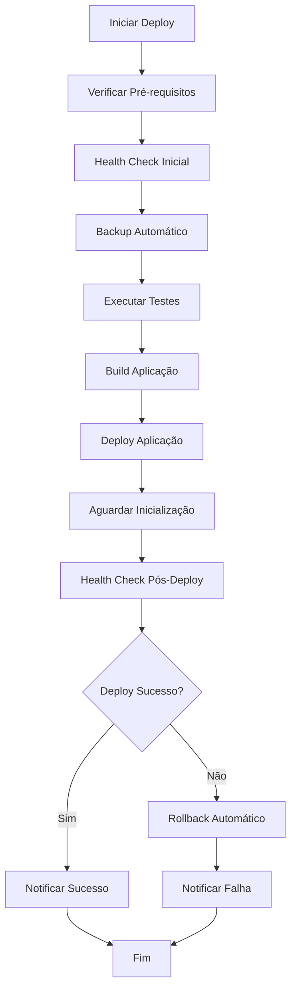

# 🛡️ Scripts de Proteção - RootGames API

Este diretório contém scripts essenciais para garantir a segurança e estabilidade da aplicação RootGames API durante atualizações e operações.

## 📋 Scripts Disponíveis

### 🔄 **backup.sh** - Backup Automático
**Descrição**: Cria backup completo do banco de dados e arquivos importantes antes de cada deploy.

**Uso**:
```bash
./scripts/backup.sh
```

**Funcionalidades**:
- ✅ Backup do banco PostgreSQL
- ✅ Backup de arquivos de configuração (.env, config/)
- ✅ Compressão automática
- ✅ Limpeza de backups antigos
- ✅ Verificação de espaço em disco
- ✅ Logs detalhados

**Configurações**:
```bash
export BACKUP_DIR="./backups"
export RETENTION_DAYS=7
export DB_HOST=127.0.0.1
export DB_PORT=5432
export DB_NAME=rootgames
export DB_USER=rootgames
export DB_PASS=rootgames
```

---

### 🔍 **health-check.sh** - Health Check com Rollback
**Descrição**: Verifica a saúde do sistema e executa rollback automático se necessário.

**Uso**:
```bash
# Health check normal (com rollback automático)
./scripts/health-check.sh

# Health check sem rollback
./scripts/health-check.sh --no-rollback
```

**Verificações**:
- ✅ Endpoints da API (health, games, admin)
- ✅ Conexão com banco de dados
- ✅ Uso de memória e CPU
- ✅ Espaço em disco
- ✅ Conectividade de rede
- ✅ Logs de erro
- ✅ Rollback automático se taxa de sucesso < 70%

**Configurações**:
```bash
export API_URL="http://localhost:1337"
export TIMEOUT=30
export RETRIES=3
export AUTO_ROLLBACK=true
```

---

### 🔄 **rollback.sh** - Rollback Automático
**Descrição**: Executa rollback completo em caso de problemas, restaurando backup e código.

**Uso**:
```bash
# Rollback básico (apenas banco)
./scripts/rollback.sh

# Rollback completo (banco + código)
./scripts/rollback.sh ./backups/backup_latest.sql true

# Ajuda
./scripts/rollback.sh --help
```

**Funcionalidades**:
- ✅ Restauração do banco de dados
- ✅ Reversão de código (opcional)
- ✅ Restauração de arquivos de configuração
- ✅ Reinicialização da aplicação
- ✅ Verificação pós-rollback
- ✅ Notificações automáticas

---

### 📊 **monitor.sh** - Monitoramento Contínuo
**Descrição**: Monitoramento em tempo real com alertas automáticos.

**Uso**:
```bash
# Monitoramento básico
./scripts/monitor.sh

# Com configurações customizadas
CHECK_INTERVAL=30 SLACK_WEBHOOK_URL="..." ./scripts/monitor.sh
```

**Funcionalidades**:
- ✅ Coleta de métricas em tempo real
- ✅ Análise de performance
- ✅ Alertas via Slack/Discord/Email
- ✅ Cooldown de alertas
- ✅ Logs estruturados
- ✅ Métricas salvas em JSON

**Configurações**:
```bash
export CHECK_INTERVAL=60
export SLACK_WEBHOOK_URL="https://hooks.slack.com/..."
export DISCORD_WEBHOOK_URL="https://discord.com/api/webhooks/..."
export ALERT_EMAIL="admin@rootgames.com"
export ALERT_COOLDOWN=300
export MAX_ALERTS_PER_HOUR=10
```

---

### 🚀 **deploy-safe.sh** - Deploy Seguro
**Descrição**: Deploy completo com todas as proteções automáticas.

**Uso**:
```bash
# Deploy para desenvolvimento
./scripts/deploy-safe.sh development

# Deploy para staging
./scripts/deploy-safe.sh staging true false

# Deploy para produção
./scripts/deploy-safe.sh production true true

# Ajuda
./scripts/deploy-safe.sh --help
```

**Funcionalidades**:
- ✅ Verificação de pré-requisitos
- ✅ Health check pré-deploy
- ✅ Backup automático
- ✅ Execução de testes
- ✅ Build da aplicação
- ✅ Deploy por ambiente
- ✅ Health check pós-deploy
- ✅ Rollback automático em caso de falha
- ✅ Notificações de resultado

---

## ⚙️ Configurações de Feature Flags

### **config/features.js**
Sistema completo de feature flags para controlar funcionalidades experimentalmente.

**Uso**:
```javascript
const features = require('./config/features');

// Verificar se feature está habilitada
if (features.redisCache) {
    // Usar Redis cache
}

// Habilitar/desabilitar via variáveis de ambiente
export FEATURE_REDIS_CACHE=true
export FEATURE_RATE_LIMITING=false
export FEATURE_REVIEWS=true
```

**Features Disponíveis**:
- **Q1 2025**: Cache, Rate Limiting, Logs Avançados
- **Q2 2025**: Reviews, Wishlist, Notificações
- **Q3 2025**: Multi-Loja, Automação, Analytics
- **Q4 2025**: Microserviços, IA, Real-time

---

## 🔧 Configuração Inicial

### 1. **Tornar Scripts Executáveis**
```bash
chmod +x scripts/*.sh
```

### 2. **Configurar Variáveis de Ambiente**
```bash
# Criar arquivo .env com configurações
cp .env.example .env

# Editar configurações
nano .env
```

### 3. **Configurar Alertas (Opcional)**
```bash
# Slack
export SLACK_WEBHOOK_URL="https://hooks.slack.com/services/..."

# Discord
export DISCORD_WEBHOOK_URL="https://discord.com/api/webhooks/..."

# Email
export ALERT_EMAIL="admin@rootgames.com"
```

### 4. **Testar Scripts**
```bash
# Testar backup
./scripts/backup.sh

# Testar health check
./scripts/health-check.sh --no-rollback

# Testar monitoramento (parar com Ctrl+C)
./scripts/monitor.sh
```

---

## 📊 Monitoramento e Logs

### **Estrutura de Logs**
```
logs/
├── backup.log          # Logs de backup
├── health-check.log    # Logs de health check
├── rollback.log        # Logs de rollback
├── deploy.log          # Logs de deploy
├── monitor.log         # Logs de monitoramento
├── alerts.log          # Alertas gerados
├── metrics.json        # Métricas em tempo real
└── monitor_stats.json  # Estatísticas de monitoramento
```

### **Métricas Coletadas**
- **API**: Tempo de resposta, status HTTP
- **Banco**: Status de conexão
- **Sistema**: Uso de memória, CPU, disco
- **Rede**: Conectividade
- **Logs**: Contagem de erros

---

## 🚨 Cenários de Emergência

### **1. API Indisponível**
```bash
# Verificar logs
tail -f logs/health-check.log

# Executar health check manual
./scripts/health-check.sh

# Se necessário, rollback automático
./scripts/rollback.sh
```

### **2. Performance Degradada**
```bash
# Verificar métricas
cat logs/metrics.json

# Desabilitar features problemáticas
export FEATURE_REDIS_CACHE=false
export FEATURE_RATE_LIMITING=false

# Reiniciar aplicação
./scripts/deploy-safe.sh development
```

### **3. Dados Corrompidos**
```bash
# Parar aplicação
pm2 stop rootgames-api

# Restaurar backup específico
./scripts/rollback.sh ./backups/backup_20250115_143022.sql

# Verificar integridade
./scripts/health-check.sh --no-rollback
```

---

## 📈 Métricas de Sucesso

### **Objetivos**
- **Zero downtime** durante atualizações
- **100% uptime** mantido
- **Rollback rate** < 5%
- **Response time** < 1 segundo
- **Error rate** < 1%

### **Indicadores**
- **Deployment success rate**: > 95%
- **Health check pass rate**: > 98%
- **Backup success rate**: 100%
- **Alert response time**: < 5 minutos

---

## 🔄 Fluxo de Deploy Seguro



---

## 📝 Manutenção

### **Limpeza de Logs**
```bash
# Limpar logs antigos (mais de 30 dias)
find logs/ -name "*.log" -mtime +30 -delete

# Limpar backups antigos (mais de 7 dias)
find backups/ -name "*.sql" -mtime +7 -delete
```

### **Atualização de Scripts**
```bash
# Fazer backup antes de atualizar
./scripts/backup.sh

# Atualizar scripts
git pull origin main

# Tornar executáveis
chmod +x scripts/*.sh

# Testar scripts
./scripts/health-check.sh --no-rollback
```

---

## 🆘 Suporte

### **Logs de Debug**
```bash
# Ver logs detalhados
tail -f logs/*.log

# Ver métricas em tempo real
watch -n 5 cat logs/metrics.json
```

### **Comandos Úteis**
```bash
# Status dos scripts
ls -la scripts/

# Verificar permissões
find scripts/ -name "*.sh" -exec ls -la {} \;

# Testar conectividade
curl -f http://localhost:1337/api/games?limit=1

# Verificar processos
ps aux | grep strapi
```

---

*Última atualização: Agosto 2025*
*Versão dos Scripts: 1.0.0*
