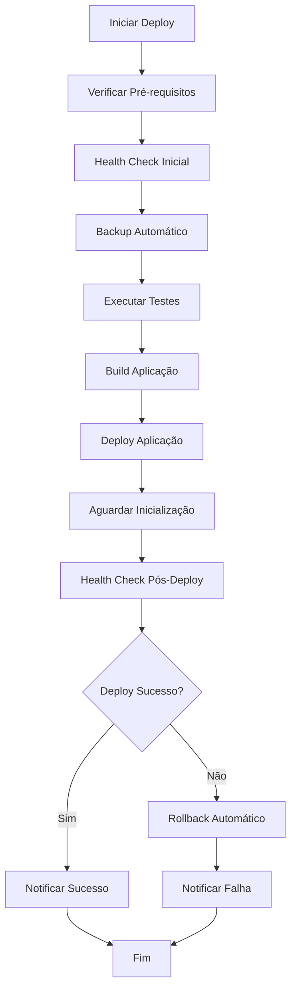

# 🛡️ Scripts de Automação - RootGames API

Este diretório contém scripts para automação de tarefas relacionadas ao projeto RootGames API.

## 🚀 Workflow de Diagnóstico Sequencial

O projeto agora inclui um sistema completo de diagnósticos sequenciais para análise e monitoramento
do projeto:

### 📋 Sequência de Diagnósticos

1. **`1_pre-diagnostico.sh`** - Preparação e verificação de dependências
2. **`2_diagnostico-sistema.sh`** - Análise do sistema e infraestrutura
3. **`3_diagnostico-aplicacao.sh`** - Diagnóstico da aplicação Strapi
4. **`4_diagnostico-performance.sh`** - Análise de performance e otimização
5. **`5_diagnostico-seguranca.sh`** - Auditoria de segurança
6. **`6_backup-verificacao.sh`** - Backup e verificação de integridade
7. **`7_relatorio-final.sh`** - Relatório consolidado e recomendações

### 🎯 Execução Completa

Para executar toda a sequência de diagnósticos:

```bash
./scripts/executar-diagnostico-completo.sh
```

Este script mestre:

- Executa todas as 7 etapas em ordem sequencial
- Verifica dependências antes de cada etapa
- Gera relatórios JSON estruturados
- Cria sumário executivo em Markdown
- Calcula score geral do projeto
- Fornece recomendações automatizadas

### 📊 Relatórios Gerados

Os relatórios são salvos em `/reports/`:

- `relatorio_final_*.json` - Dados completos consolidados
- `sumario_executivo_*.md` - Resumo executivo
- Relatórios individuais de cada etapa

### 🔧 Execução Individual

Cada script pode ser executado independentemente:

```bash
./scripts/1_pre-diagnostico.sh
./scripts/2_diagnostico-sistema.sh
# ... e assim por diante
```

## 🚀 Novos Scripts Avançados (Agosto 2025)

### 🔍 **diagnostico-completo.sh** - Diagnóstico Completo do Sistema

**Descrição**: Script avançado de diagnóstico que analisa todos os aspectos do projeto.

**Uso**:

```bash
./scripts/diagnostico-completo.sh
```

**Funcionalidades**:

- ✅ Análise completa do sistema operacional
- ✅ Verificação do ambiente Node.js e dependências
- ✅ Validação do projeto Strapi e configurações
- ✅ Teste de conectividade com banco de dados
- ✅ Verificação de endpoints da API
- ✅ Análise de performance e recursos
- ✅ Auditoria de segurança
- ✅ Relatório em JSON com métricas detalhadas
- ✅ Recomendações automáticas de melhorias

**Saída**: Relatório salvo em `reports/diagnostico_YYYYMMDD_HHMMSS.json`

---

### 📊 **monitor-avancado.sh** - Monitoramento Inteligente

**Descrição**: Sistema de monitoramento em tempo real com alertas inteligentes.

**Uso**:

```bash
# Iniciar monitoramento
./scripts/monitor-avancado.sh start

# Iniciar com output detalhado
./scripts/monitor-avancado.sh start --verbose

# Ver status atual
./scripts/monitor-avancado.sh status

# Parar monitoramento
./scripts/monitor-avancado.sh stop
```

**Funcionalidades**:

- ✅ Monitoramento de CPU, memória e disco
- ✅ Verificação contínua da API e banco de dados
- ✅ Análise de logs de erro em tempo real
- ✅ Alertas inteligentes com cooldown
- ✅ Integração com webhooks (Slack/Discord)
- ✅ Métricas salvas em JSON para análise
- ✅ Histórico de alertas e métricas
- ✅ Thresholds configuráveis

**Configurações**:

```bash
export MONITOR_INTERVAL=60
export CPU_THRESHOLD=80
export MEMORY_THRESHOLD=85
export RESPONSE_TIME_THRESHOLD=2000
export MONITOR_WEBHOOK_URL="https://hooks.slack.com/..."
```

---

### ⚙️ **setup-scripts.sh** - Configuração Automática

**Descrição**: Configura automaticamente todos os scripts e dependências.

**Uso**:

```bash
./scripts/setup-scripts.sh
```

**Funcionalidades**:

- ✅ Configuração automática de permissões
- ✅ Criação de diretórios necessários
- ✅ Verificação de dependências
- ✅ Configuração inicial do .env
- ✅ Validação do ambiente

---

## 📋 Scripts Disponíveis (Legados Melhorados)

### 🔄 **backup.sh** - Backup Automático

**Descrição**: Cria backup completo do banco de dados e arquivos importantes antes de cada deploy.

**Uso**:

```bash
./scripts/backup.sh
```

**Funcionalidades**:

- ✅ Backup do banco PostgreSQL
- ✅ Backup de arquivos de configuração (.env, config/)
- ✅ Compressão automática
- ✅ Limpeza de backups antigos
- ✅ Verificação de espaço em disco
- ✅ Logs detalhados

**Configurações**:

```bash
export BACKUP_DIR="./backups"
export RETENTION_DAYS=7
export DB_HOST=127.0.0.1
export DB_PORT=5432
export DB_NAME=rootgames
export DB_USER=rootgames
export DB_PASS=rootgames
```

---

### 🔍 **health-check.sh** - Health Check com Rollback

**Descrição**: Verifica a saúde do sistema e executa rollback automático se necessário.

**Uso**:

```bash
# Health check normal (com rollback automático)
./scripts/health-check.sh

# Health check sem rollback
./scripts/health-check.sh --no-rollback
```

**Verificações**:

- ✅ Endpoints da API (health, games, admin)
- ✅ Conexão com banco de dados
- ✅ Uso de memória e CPU
- ✅ Espaço em disco
- ✅ Conectividade de rede
- ✅ Logs de erro
- ✅ Rollback automático se taxa de sucesso < 70%

**Configurações**:

```bash
export API_URL="http://localhost:1337"
export TIMEOUT=30
export RETRIES=3
export AUTO_ROLLBACK=true
```

---

### 🔄 **rollback.sh** - Rollback Automático

**Descrição**: Executa rollback completo em caso de problemas, restaurando backup e código.

**Uso**:

```bash
# Rollback básico (apenas banco)
./scripts/rollback.sh

# Rollback completo (banco + código)
./scripts/rollback.sh ./backups/backup_latest.sql true

# Ajuda
./scripts/rollback.sh --help
```

**Funcionalidades**:

- ✅ Restauração do banco de dados
- ✅ Reversão de código (opcional)
- ✅ Restauração de arquivos de configuração
- ✅ Reinicialização da aplicação
- ✅ Verificação pós-rollback
- ✅ Notificações automáticas

---

### 📊 **monitor.sh** - Monitoramento Contínuo

**Descrição**: Monitoramento em tempo real com alertas automáticos.

**Uso**:

```bash
# Monitoramento básico
./scripts/monitor.sh

# Com configurações customizadas
CHECK_INTERVAL=30 SLACK_WEBHOOK_URL="..." ./scripts/monitor.sh
```

**Funcionalidades**:

- ✅ Coleta de métricas em tempo real
- ✅ Análise de performance
- ✅ Alertas via Slack/Discord/Email
- ✅ Cooldown de alertas
- ✅ Logs estruturados
- ✅ Métricas salvas em JSON

**Configurações**:

```bash
export CHECK_INTERVAL=60
export SLACK_WEBHOOK_URL="https://hooks.slack.com/..."
export DISCORD_WEBHOOK_URL="https://discord.com/api/webhooks/..."
export ALERT_EMAIL="admin@rootgames.com"
export ALERT_COOLDOWN=300
export MAX_ALERTS_PER_HOUR=10
```

---

### 🚀 **deploy-safe.sh** - Deploy Seguro

**Descrição**: Deploy completo com todas as proteções automáticas.

**Uso**:

```bash
# Deploy para desenvolvimento
./scripts/deploy-safe.sh development

# Deploy para staging
./scripts/deploy-safe.sh staging true false

# Deploy para produção
./scripts/deploy-safe.sh production true true

# Ajuda
./scripts/deploy-safe.sh --help
```

**Funcionalidades**:

- ✅ Verificação de pré-requisitos
- ✅ Health check pré-deploy
- ✅ Backup automático
- ✅ Execução de testes
- ✅ Build da aplicação
- ✅ Deploy por ambiente
- ✅ Health check pós-deploy

---

### 🚀 **start-monitoring.sh** - Iniciar Monitoramento

**Descrição**: Inicia monitoramento contínuo em produção com configurações otimizadas.

**Uso**:

```bash
# Iniciar com intervalo padrão (60s)
./scripts/start-monitoring.sh

# Iniciar com intervalo customizado
./scripts/start-monitoring.sh 30

# Ajuda
./scripts/start-monitoring.sh --help
```

**Funcionalidades**:

- ✅ Verificação de monitor já rodando
- ✅ Configuração automática de diretórios
- ✅ Configurações otimizadas para produção
- ✅ Execução em background com PID
- ✅ Logs estruturados e organizados
- ✅ Integração com sistema de alertas

**Configurações de Produção**:

```bash
export MONITOR_INTERVAL=60
export ALERT_COOLDOWN=300
export MAX_ALERTS_PER_HOUR=10
export ERROR_THRESHOLD=5
export RESPONSE_TIME_THRESHOLD=2000
export MEMORY_THRESHOLD=85
export CPU_THRESHOLD=80
```

---

### 🛑 **stop-monitoring.sh** - Parar Monitoramento

**Descrição**: Para o monitoramento contínuo de forma segura.

**Uso**:

```bash
# Parar monitoramento
./scripts/stop-monitoring.sh

# Ajuda
./scripts/stop-monitoring.sh --help
```

**Funcionalidades**:

- ✅ Parada segura com PID salvo
- ✅ Aguardar parada natural
- ✅ Forçar parada se necessário
- ✅ Limpeza de arquivos temporários
- ✅ Relatório final de execução
- ✅ Estatísticas de monitoramento

---

### 📊 **monitor-status.sh** - Status do Monitoramento

**Descrição**: Verifica status completo do monitoramento contínuo.

**Uso**:

```bash
# Verificar status completo
./scripts/monitor-status.sh

# Ajuda
./scripts/monitor-status.sh --help
```

**Funcionalidades**:

- ✅ Status do processo de monitoramento
- ✅ Verificação de logs recentes
- ✅ Análise de métricas coletadas
- ✅ Recursos do sistema em tempo real
- ✅ Conectividade de serviços
- ✅ Relatório completo de status
- ✅ Rollback automático em caso de falha
- ✅ Notificações de resultado

---

### 🔄 **prepare-strapi5-migration.sh** - Preparar Migração Strapi 5.x

**Descrição**: Prepara ambiente completo para migração segura para Strapi 5.x.

**Uso**:

```bash
# Preparar migração
./scripts/prepare-strapi5-migration.sh

# Ajuda
./scripts/prepare-strapi5-migration.sh --help
```

**Funcionalidades**:

- ✅ Verificação de pré-requisitos (Node.js 18+, Yarn, PostgreSQL)
- ✅ Backup completo do sistema atual
- ✅ Criação de branch de staging
- ✅ Configuração de ambiente de staging
- ✅ Criação de banco de dados de staging
- ✅ Restauração de dados de produção para staging
- ✅ Análise de impacto da migração
- ✅ Verificação de dependências e configurações

**Configurações**:

```bash
export STAGING_DB="rootgames_staging"
export BACKUP_FILE="./backups/backup_latest.sql"
```

---

### 🚀 **migrate-strapi5.sh** - Executar Migração Strapi 5.x

**Descrição**: Executa migração completa para Strapi 5.x com rollback automático.

**Uso**:

```bash
# Executar migração
./scripts/migrate-strapi5.sh

# Ajuda
./scripts/migrate-strapi5.sh --help
```

**Funcionalidades**:

- ✅ Verificação de ambiente de staging
- ✅ Backup final antes da migração
- ✅ Migração oficial via `npx @strapi/upgrade major`
- ✅ Migração manual como fallback
- ✅ Remoção automática do plugin i18n
- ✅ Atualização de dependências React
- ✅ Verificação de compatibilidade
- ✅ Build e teste da aplicação
- ✅ Rollback automático em caso de falha
- ✅ Commit das mudanças de migração

**Rollback Automático**:

- ✅ Restauração de código via Git
- ✅ Restauração de dependências
- ✅ Restauração de banco de dados
- ✅ Verificação pós-rollback

---

### 🧪 **validate-strapi5.sh** - Validar Migração Strapi 5.x

**Descrição**: Validação completa da migração com testes automatizados.

**Uso**:

```bash
# Executar validação completa
./scripts/validate-strapi5.sh

# Ajuda
./scripts/validate-strapi5.sh --help
```

**Testes Executados**:

- ✅ Verificação de versão Strapi 5.x
- ✅ Validação de plugins compatíveis
- ✅ Verificação de dependências React
- ✅ Teste de build da aplicação
- ✅ Verificação de arquivos de configuração
- ✅ Teste de funcionalidades básicas
- ✅ Validação de endpoints (REST, GraphQL, Admin)
- ✅ Verificação de peer dependencies
- ✅ Análise de estrutura de arquivos
- ✅ Relatório detalhado em JSON

**Resultados**:

- 📊 Relatório com taxa de sucesso
- 📁 Logs detalhados de validação
- 🎯 Recomendações de próximos passos
- ⚠️ Alertas para problemas identificados

---

### 🔄 **rollback-strapi5.sh** - Rollback da Migração Strapi 5.x

---

## 🚀 **Scripts de Otimização LTS 2025**

### 🚀 **implement-lts-optimization.sh** - Implementar Otimizações LTS

**Descrição**: Implementa otimizações LTS completas (React 19, Node.js 22, NPM 9.x).

**Uso**:

```bash
# Executar otimização completa
./scripts/implement-lts-optimization.sh

# Ajuda
./scripts/implement-lts-optimization.sh --help
```

**Funcionalidades**:

- ✅ Backup completo do sistema
- ✅ Atualização Node.js para 22.x
- ✅ Atualização NPM para 9.x
- ✅ Atualização React para 19.1.1
- ✅ Atualização React Router DOM
- ✅ Instalação de dependências
- ✅ Testes de build e desenvolvimento
- ✅ Geração de relatório completo
- ✅ Rollback automático em caso de falha

**Versões Atualizadas**:

- Node.js: 22.x (LTS até 2026)
- NPM: 9.8.x (última estável)
- React: 19.1.1 (LTS mais recente)
- React DOM: 19.1.1
- React Router DOM: 6.30.1

---

### 🔄 **rollback-lts-optimization.sh** - Rollback das Otimizações LTS

**Descrição**: Rollback completo das otimizações LTS para versões anteriores.

**Uso**:

```bash
# Executar rollback
./scripts/rollback-lts-optimization.sh

# Ajuda
./scripts/rollback-lts-optimization.sh --help
```

**Funcionalidades**:

- ✅ Verificação de backups disponíveis
- ✅ Rollback do package.json
- ✅ Rollback completo (se disponível)
- ✅ Reinstalação de dependências
- ✅ Teste de rollback
- ✅ Geração de relatório de rollback **Descrição**: Rollback específico e seguro da migração Strapi
  5.x.

**Uso**:

```bash
# Rollback interativo
./scripts/rollback-strapi5.sh

# Rollback forçado
./scripts/rollback-strapi5.sh --force

# Rollback apenas staging
./scripts/rollback-strapi5.sh --staging-only

# Ajuda
./scripts/rollback-strapi5.sh --help
```

**Funcionalidades**:

- ✅ Verificação de branch e ambiente
- ✅ Confirmação interativa do usuário
- ✅ Backup antes do rollback
- ✅ Rollback de código via Git
- ✅ Restauração de dependências Strapi 4.x
- ✅ Restauração de banco de dados
- ✅ Verificação de build e funcionamento
- ✅ Commit do rollback
- ✅ Modo staging-only para testes

**Segurança**:

- 🛡️ Confirmação para rollback em produção
- 🛡️ Backup automático antes do rollback
- 🛡️ Verificação de integridade pós-rollback
- 🛡️ Logs detalhados de todas as operações

---

## ⚙️ Configurações de Feature Flags

### **config/features.js**

Sistema completo de feature flags para controlar funcionalidades experimentalmente.

**Uso**:

```javascript
const features = require('./config/features');

// Verificar se feature está habilitada
if (features.redisCache) {
    // Usar Redis cache
}

// Habilitar/desabilitar via variáveis de ambiente
export FEATURE_REDIS_CACHE=true
export FEATURE_RATE_LIMITING=false
export FEATURE_REVIEWS=true
```

**Features Disponíveis**:

- **Q1 2025**: Cache, Rate Limiting, Logs Avançados
- **Q2 2025**: Reviews, Wishlist, Notificações
- **Q3 2025**: Multi-Loja, Automação, Analytics
- **Q4 2025**: Microserviços, IA, Real-time

---

## 🔧 Configuração Inicial

### 1. **Tornar Scripts Executáveis**

```bash
chmod +x scripts/*.sh
```

### 2. **Configurar Variáveis de Ambiente**

```bash
# Criar arquivo .env com configurações
cp .env.example .env

# Editar configurações
nano .env
```

### 3. **Configurar Alertas (Opcional)**

```bash
# Slack
export SLACK_WEBHOOK_URL="https://hooks.slack.com/services/..."

# Discord
export DISCORD_WEBHOOK_URL="https://discord.com/api/webhooks/..."

# Email
export ALERT_EMAIL="admin@rootgames.com"
```

### 4. **Testar Scripts**

```bash
# Testar backup
./scripts/backup.sh

# Testar health check
./scripts/health-check.sh --no-rollback

# Testar monitoramento (parar com Ctrl+C)
./scripts/monitor.sh
```

---

## 📊 Monitoramento e Logs

### **Estrutura de Logs**

```
logs/
├── backup.log          # Logs de backup
├── health-check.log    # Logs de health check
├── rollback.log        # Logs de rollback
├── deploy.log          # Logs de deploy
├── monitor.log         # Logs de monitoramento
├── alerts.log          # Alertas gerados
├── metrics.json        # Métricas em tempo real
└── monitor_stats.json  # Estatísticas de monitoramento
```

### **Métricas Coletadas**

- **API**: Tempo de resposta, status HTTP
- **Banco**: Status de conexão
- **Sistema**: Uso de memória, CPU, disco
- **Rede**: Conectividade
- **Logs**: Contagem de erros

---

## 🚨 Cenários de Emergência

### **1. API Indisponível**

```bash
# Verificar logs
tail -f logs/health-check.log

# Executar health check manual
./scripts/health-check.sh

# Se necessário, rollback automático
./scripts/rollback.sh
```

### **2. Performance Degradada**

```bash
# Verificar métricas
cat logs/metrics.json

# Desabilitar features problemáticas
export FEATURE_REDIS_CACHE=false
export FEATURE_RATE_LIMITING=false

# Reiniciar aplicação
./scripts/deploy-safe.sh development
```

### **3. Dados Corrompidos**

```bash
# Parar aplicação
pm2 stop rootgames-api

# Restaurar backup específico
./scripts/rollback.sh ./backups/backup_20250115_143022.sql

# Verificar integridade
./scripts/health-check.sh --no-rollback
```

---

## 📈 Métricas de Sucesso

### **Objetivos**

- **Zero downtime** durante atualizações
- **100% uptime** mantido
- **Rollback rate** < 5%
- **Response time** < 1 segundo
- **Error rate** < 1%

### **Indicadores**

- **Deployment success rate**: > 95%
- **Health check pass rate**: > 98%
- **Backup success rate**: 100%
- **Alert response time**: < 5 minutos

---

## 🔄 Fluxo de Deploy Seguro



---

## 📝 Manutenção

### **Limpeza de Logs**

```bash
# Limpar logs antigos (mais de 30 dias)
find logs/ -name "*.log" -mtime +30 -delete

# Limpar backups antigos (mais de 7 dias)
find backups/ -name "*.sql" -mtime +7 -delete
```

### **Atualização de Scripts**

```bash
# Fazer backup antes de atualizar
./scripts/backup.sh

# Atualizar scripts
git pull origin main

# Tornar executáveis
chmod +x scripts/*.sh

# Testar scripts
./scripts/health-check.sh --no-rollback
```

---

## 🆘 Suporte

### **Logs de Debug**

```bash
# Ver logs detalhados
tail -f logs/*.log

# Ver métricas em tempo real
watch -n 5 cat logs/metrics.json
```

### **Comandos Úteis**

```bash
# Status dos scripts
ls -la scripts/

# Verificar permissões
find scripts/ -name "*.sh" -exec ls -la {} \;

# Testar conectividade
curl -f http://localhost:1337/api/games?limit=1

# Verificar processos
ps aux | grep strapi
```

---

## 🔧 Configuração Rápida

### 1. **Configuração Inicial**

```bash
# Executar configuração automática
./scripts/setup-scripts.sh

# Executar diagnóstico inicial
./scripts/diagnostico-completo.sh
```

### 2. **Iniciar Monitoramento**

```bash
# Monitoramento básico
./scripts/monitor-avancado.sh start

# Monitoramento com detalhes
./scripts/monitor-avancado.sh start --verbose
```

### 3. **Verificação de Saúde**

```bash
# Health check completo
./scripts/health-check-improved.sh

# Backup automático
./scripts/backup-improved.sh
```

---

## 📊 Estrutura de Arquivos Gerados

```
logs/
├── diagnostico_detalhado_YYYYMMDD_HHMMSS.log
├── metrics_realtime.json
├── metrics_history_YYYY-MM-DD.json
├── alerts_history.json
└── YYYY-MM-DD.log

reports/
├── diagnostico_YYYYMMDD_HHMMSS.json
└── diagnostico_YYYYMMDD_HHMMSS.html

backups/
├── backup_YYYYMMDD_HHMMSS.sql
└── config_backup_YYYYMMDD_HHMMSS.tar.gz
```

---

## 🎯 Melhorias da Versão 2.0.0

### **Novos Recursos**

- 🔍 **Diagnóstico Completo**: Análise abrangente do sistema
- 📊 **Monitoramento Inteligente**: Alertas com cooldown e thresholds
- ⚙️ **Setup Automático**: Configuração simplificada
- 📄 **Relatórios JSON**: Dados estruturados para análise
- 🔒 **Auditoria de Segurança**: Verificação de permissões e configurações

### **Melhorias Técnicas**

- 🚀 **Performance**: Scripts otimizados e mais rápidos
- 🛡️ **Segurança**: Validação rigorosa e sanitização
- 📋 **Logs Estruturados**: Melhor rastreabilidade
- 🔄 **Retry Logic**: Maior confiabilidade
- 🎨 **UI/UX**: Output mais limpo e informativo

### **Compatibilidade**

- ✅ **Strapi 5.21.0**: Totalmente compatível
- ✅ **Node.js 20+**: Suporte às versões LTS
- ✅ **PostgreSQL**: Otimizado para banco principal
- ✅ **Linux/macOS**: Multiplataforma

---

## 🆘 Solução de Problemas

### **Script não executa**

```bash
# Verificar permissões
ls -la scripts/

# Corrigir permissões
chmod +x scripts/*.sh
```

### **Dependências ausentes**

```bash
# Ubuntu/Debian
sudo apt update && sudo apt install -y curl jq bc postgresql-client

# macOS
brew install curl jq bc postgresql
```

### **Problemas de conectividade**

```bash
# Verificar configurações
cat .env

# Testar conexão manual
psql -h localhost -p 5432 -U rootgames -d rootgames
```

---

_Última atualização: Agosto 2025_ _Versão dos Scripts: 2.0.0_ _Sistema desenvolvido com base nas
memórias do projeto e melhores práticas_
